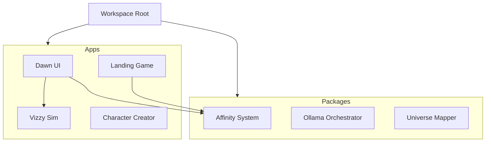

# Final Dawn of Eideus


> **"Sunlight is a subscription service. Your debt is your value."**

**Final Dawn of Eideus** is a massive demonstration of the proprietary **Fractal Template System**.

While intended to be played as a unified sci-fi interface and simulation experience, the primary purpose of this codebase is to showcase the capabilities of the underlying 3x3x7 Recursive Architecture. It combines high-fidelity 3D visualizations, tactical dashboard interfaces, and generative AI-driven narratives into a cohesive cyberpunk experience to prove the template's versatility.

This monorepo orchestrates multiple specialized applications, from orbital drop simulations (`landing-game`) to abstract fractal state machines (`Vizzy`).

---

## ✨ Key Features

### 🌌 Vizzy: Fractal Lattice Simulation
A procedural animation engine visualized through a high-performance particle system.
-   **Three-Tier Protocol**: Cycles through **Structural (T1)**, **Aesthetic (T2)**, and **Environmental (T3)** transforms.
-   **Dual-Zone Dynamics**: Features a dense, counter-rotating cylindrical core surrounded by a sparse, spherical shell of gold particulates.
-   **Fractal Control**: Driven by a hypercube lattice (0-6 coordinates) that maps abstract data to visual states.

### 🖥️ Dawn UI: The Interface
The primary tactical dashboard for the Eideus system.
-   **Unified HUD**: Integrates data from multiple subsystems into a single glassmorphism-styled interface.
-   **Live Simulation Integration**: Embeds the `Vizzy` engine directly into the layout.
-   **Reactive components**: Marquee tickers, debt counters, and biological status monitors.

### 🚀 Landing Game
An orbital drop simulation mini-game.
-   **Physics-based Flight**: Control a landing pod through atmospheric entry.
-   **AI Chatter**: Features dynamic narration and mission updates powered by Google Gemini.
-   **3D Environment**: Built with React Three Fiber for immersive visuals.

### 🤖 Character Creation
An experimental text-adventure interface for generating RPG characters.
-   **Generative Backstories**: Uses LLMs to craft unique user histories.
-   **Affinity Mapping**: translated narrative choices into concrete game stats (affinities).

---

## 🏗️ Architecture

This project is a **Monorepo** managed by [PNPM Workspaces](https://pnpm.io/workspaces).



### Directory Structure
-   `apps/`
    -   `dawn-ui`: Main React application.
    -   `Vizzy`: The fractal particle simulation engine.
    -   `landing-game`: Orbital drop mini-game.
    -   `character-creation`: LLM-powered RPG tool.
-   `packages/`
    -   `eideus-*`: Shared logic for physics, progression, and AI orchestration.

---

## 🛠️ Getting Started

### Prerequisites
-   **Node.js**: v20 or higher.
-   **PNPM**: `npm install -g pnpm`
-   **Ollama**: Required for local AI inference.
    -   Install from [ollama.com](https://ollama.com/).
    -   Pull default models: `ollama pull llama3` and `ollama pull nomic-embed-text`.
-   **Hardware**: A dedicated GPU is recommended for `Vizzy` and `landing-game` (WebGL).

### System Architecture

For a deep dive into the code structure, monorepo layout, and AI orchestration, please see [ARCHITECTURE.md](./ARCHITECTURE.md).

### Installation

1.  **Clone the repository**
    ```bash
    git clone https://github.com/AnastasisConsulting/Final-Dawn.git
    cd Final-Dawn
    ```

2.  **Install dependencies**
    ```bash
    pnpm install
    ```

3.  **Build the workspace**
    ```bash
    pnpm run build
    ```

### Running the Apps

The project includes helper scripts to launch specific experiences:

| Application | Command | Description |
| :--- | :--- | :--- |
| **Dawn UI** | `pnpm run dev:dawn-ui` | The main dashboard interface. |
| **Landing Game** | `pnpm run dev:landing-game` | The orbital flight simulator. |
| **Character Gen** | `pnpm run dev:character-creation` | The AI text-adventure. |

### Environment Setup
Required for AI features (Character Creation, Landing Game chatter):
1.  Create a `.env.local` file in the respective app directory (e.g., `apps/character-creation/.env.local`).
2.  Add your API key:
    ```env
    GEMINI_API_KEY=your_key_here
    ```

---

## 🤝 Contributing

We welcome contributions! Please read [CONTRIBUTING.md](./CONTRIBUTING.md) for details on our code of conduct and the process for submitting pull requests.

## ⚖️ License

**EIDEUS COMMUNITY & COMMERCIAL LICENSE (Dual-License Model)**

This project is licensed under a custom agreement designed to protect the system's architecture while encouraging community innovation:

1.  **Community License (Free)**: Free for **non-commercial** use and modding.
    -   **CRITICAL**: You **MUST** post your source code publicly if you distribute modifications under this license.
2.  **Commercial License (Paid)**: Required for any revenue-generating activity.
    -   Waives the requirement to share source code.
    -   Allows commercial distribution and monetization.
3.  **Fractal System**: The **3x3x7 Recursive Architecture** (Memory Lattice, `Galaxies_Folder`) remains proprietary property.

See [LICENSE](./LICENSE) for full legal text and licensing inquiries.
